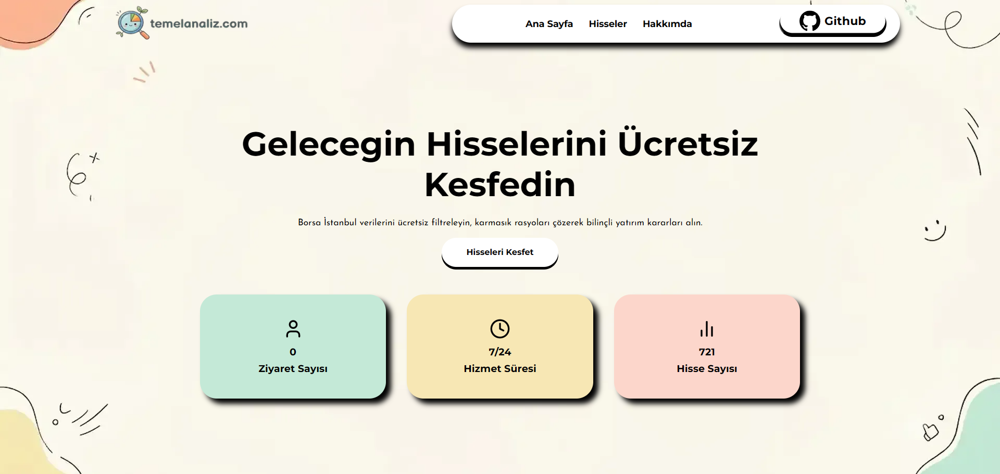
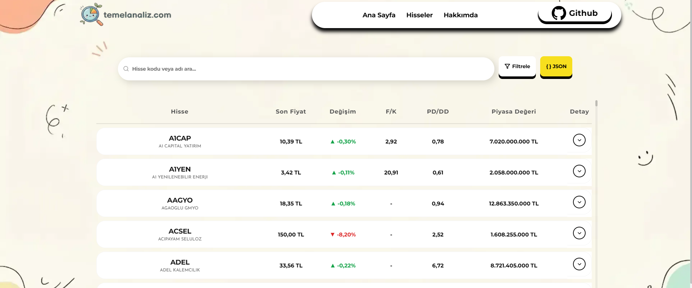
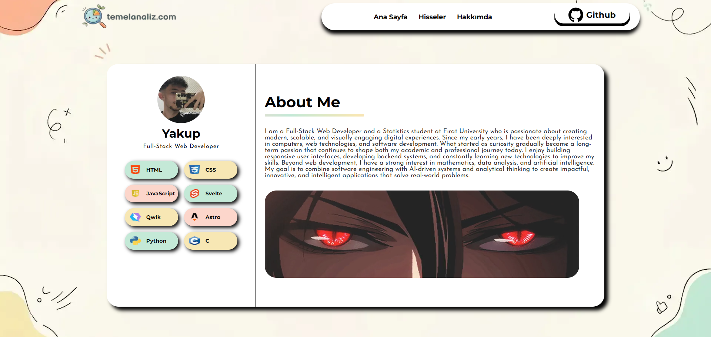

# Temel Analiz

Bu proje, finansal/veri analizi üzerine geliştirilmiş bir web uygulamasıdır.

## Proje Hakkında :3

**Temel Analiz**, farklı kaynaklardan Python ile veri çekerek bu verileri işleyen ve web üzerinde JSON formatında görselleştiren bir analiz platformudur.

## Kullanılan Teknolojiler

-  Python (veri çekme ve veri işleme)
-  JSON (veri aktarımı ve frontend kullanımı)
-  Responsive Web Tasarım
-  HTML / CSS / JavaScript

##  Özellikler

- Python ile farklı kaynaklardan veri çekme
- Verilerin işlenip JSON formatına dönüştürülmesi
- Web arayüzünde dinamik veri gösterimi
- Mobil uyumlu (responsive) tasarım
- Astro’nun hızlı build ve component avantajları

Astro kullandım deneyim olarak güzeldi saf html css js yazmayı ozlemisim ama bazı konularda cok dusuk yani svelte daha hosuma gidiyor hala ama gayet hızlı ve güzel kullanıslıydı.

Netlify link (Live Demo) : glittering-smakager-f9f1fb.netlify.app

